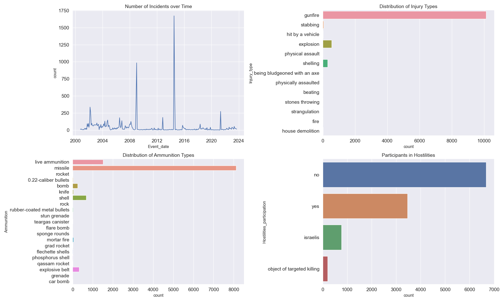
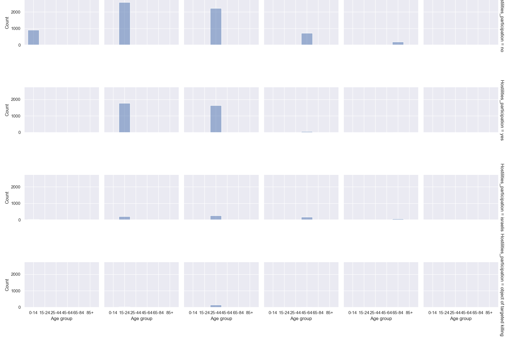

# Incident Analysis in the Middle-east

### Overview

In this project, it involved data wrangling, analysis, feature engineering and visualization of the dataset detailing various incidents. The dataset features several columns, including name, event date, age, citizenship, event location, gender, participation in hostilities, place of residence, type of injury, ammunition used, and others. 
My objective was to clean the data and create insightful visualizations to uncover patterns and distributions within the data. Lastly perform a machine task ----

### Data Wrangling

To prepare the dataset for detailed analysis, I implemented several cleaning steps:

1. **Handling Missing Values**: 
   - To handle missing values, I utilized the `DataHandling` class provided in the `data_processing.py` script. This script includes methods to convert `None` and `unknown` values to `np.nan` and then fill these misssing values using the `SimpleImputer` appropriate strategies for numerical (`mean`) and categorical (`most_frequent`) columns respectively.
   Additionally, I dropped 2 missing values in critical columns such as `AgeGroup`.

2. **Converting Data Types**: 
   - Converted the `Age` column from `float64` to `int32`.
   - Converted `EventDate` and `DeathDate` columns to datetime format.

3. **Changing Age data type and categorizing Age Groups**: 
   - I converted the `Age` column from float to integer and created age groups according to the United Nations classification:

     ```python
     bins = [0, 5, 12, 18, 24, 65, 100]
     labels = ['0-4', '5-11', '12-17', '18-23', '24-64', '65+']
     data['AgeGroup'] = pd.cut(data['Age'], bins=bins, labels=labels, right=False)
     ```

4. **Ensuring Consistent Column Naming and Stripping**: 
   - I Standardized the column names to follow a consistent naming convention for better readability and consistency.
   Also, I remove extra spaces from categorical variables and assisgned them to be in lowercase to ensure data consistency.

### Data Analysis and Visualization

Several visualizations were created to analyze the data and derive insights, which were segmented into sections:

### 1. Insight from Incident Analysis

- **Number of Incidents over time:**
This line plot provides a comprehensive view of how incidents have evolved over the specified period. This chart displays the count of incidents plotted over a timeline from the year 2000 to just beyond 2024. The line fluctuates with noticeable peaks around the years 2008, 2012, and 2016, suggesting significant events or escalations in incidents during these periods. The data provides insights into the temporal dynamics of the incidents, potentially reflecting underlying political or social changes.
Times when the number of incidents significantly decreases, potentially indicating effective interventions or changes in external factors. Analyzing these trends helps in understanding the temporal dynamics of the incidents and can guide further investigations.

- **Distribution of Ammunition Types:** 
This chart categorizes the types of ammunition used in incidents. The lengths of the bars indicate the frequency of each type, with "live ammunition" and "missile" being the most commonly used, followed by "rocket" and "0.22-caliber bullets". Other types, such as "bomb", "knife", and various forms of shells and rockets, are represented with significantly lower frequencies. This visualization helps in understanding the weaponry dynamics in the recorded incidents.

- **Distribution of Injury Types:** 
This count plot showcases the distribution of various injury types recorded in the incidents. The chart is organized with injury types on the y-axis and counts on the x-axis. "Gunfire" injuries are the most frequent, followed by "shelling", "explosion", and "hit by a vehicle". Less frequent injury types include "strangulation", "stones throwing", and "house demolition". This chart offers a clear view of the most common hazards or violence types in the dataset.

- **Participants in Hostilities:** 
This represents the participation status in hostilities, categorized into "yes", "no", "Israelis", and "object of targeted killing". The largest group represented is "no", indicating that the majority of the records pertain to non-participants. The category "yes" shows a significant number of participants, while "Israelis" and "object of targeted killing" have much lower counts. This plot provides insights into the involvement of different groups or categories of individuals in the incidents.

### 2. Insight from Demographic Visualizations

- **Age Distribution:**
The histogram shows the distribution of ages within the dataset, with a kernel density estimate (KDE) overlay to provide a smooth curve of the age distribution.
The histogram bars depict the count of individuals within specific age intervals. The KDE curve smooths these counts to show a continuous probability distribution of ages. The distribution peaks sharply around age 20 and declines thereafter, indicating a younger population in the dataset.

- **Gender Distribution:**
This count plot shows the distribution of genders in the dataset. It provides a clear view of the proportion of different genders, helping to identify any gender imbalances in the data.
Furthermore, the number of males significantly outweighs the number of females, as shown by the taller blue bar for males.

- **Citizenship Distribution:**
This count plot highlights the frequency of different citizenships among the individuals in the dataset. The categories shown include Palestinian, Israeli, Jordanian, and American. Palestinians constitute the overwhelming majority, followed by a much smaller count of Israelis, Jordanians, and Americans.
It shows the diversity of the sample, indicating the representation of various nationalities.
Insights from this plot can guide resource allocation and support services based on the citizenship distribution.

- **Top 20 Event Locations:**
This count plot shows the distribution of events across different regions. It provides a regional perspective, helping to identify regions with higher incident rates. By displaying the top 20 event locations by the count of events or individuals associated with each location. Locations like Gaza City, Rafah, and Khan Yunis have the highest counts, with Gaza City leading significantly.

- **Regional Distribution:**
Shows the number of events or individuals by region, including West Bank, Gaza Strip, and Israel. The West Bank has the highest count, followed by the Gaza Strip, with Israel having a significantly lower count.

- **Violin Plot Age by Gender:**
This box plot (with whiskers) shows the distribution of ages for different genders. This plot combines box plots and KDE plots to show the distribution’s density along with the interquartile range. For males, the age distribution is more spread out with a wider interquartile range, while females have a narrower age distribution concentrated around the median.

### 3. Insight of Incident Casualties

- **Heatmap of Age Groups by Injury Types:**
This chart shows the frequency of different types of injuries across various age groups. The x-axis represents age groups divided into 0-14, 15-24, 25-44, 45-64, and 65+. The y-axis lists types of injuries such as beating, being bludgeoned with an axe, explosions, fire, gunfire, and several others. Each cell in the heatmap is colored based on the count of incidents, with darker blue indicating higher frequencies. The chart highlights, for example, that gunfire incidents are particularly high among the 15-24 and 25-44 age groups.
This information is useful for planning age-specific interventions and preventive measures.

- **Box Plot of Incident Duration by Age Group:**
This chart displays the distribution of incident durations for different age groups, with age groups on the x-axis and incident duration on the y-axis. The box plot for each age group shows the median, quartiles, and outliers in incident duration. It appears that the 25-44 age group has the widest range of incident durations, indicating variability in how long the incidents impact these ages.
Understanding incident duration can help in resource planning and allocation, ensuring that adequate support is available for age groups that experience longer incidents.

- **Heatmap of Event Locations by Region:**
This heatmap shows the frequency of different types of incidents in various regions (Gaza Strip, Israel, West Bank). Each row represents a type of incident (like beating, gunfire, shelling), and each column represents a region. The color intensity in each cell shows the frequency of incidents, with darker shades indicating higher numbers. For example, gunfire incidents are exceptionally high in the Gaza Strip, as indicated by the red color.
With this it helps in identifying regions with higher incidences of specific injury types.
This information is valuable for regional planning and targeted interventions in high-risk areas.


- **Facet Grid of Age Distribution by Gender and Hostilities Participation:**
This facet grid shows the age distribution for different genders and their participation in hostilities.
- Gender and Age Patterns: I observed how age distribution varies between genders and whether they participated in hostilities.
- Policy and Support Services: These insights can inform gender-specific policies and support services, addressing the needs of different groups based on their demographic characteristics.

### SQL SECTION.

I initiated the process by establishing an SQLAlchemy engine to manage connections to my SQLite database, which is stored in the `RedBank` directory on my computer. After configuring the engine, I proceeded to activate the SQL extension in my Jupyter Notebook. This activation permitted the direct execution of SQL queries within the notebook's cells.

Following the successful activation of the SQL extension, I connected it to my SQLite database using the designated filepath. This connection facilitated direct interactions with the database through SQL commands, enhancing the efficiency of data manipulation and retrieval.

Subsequently, I incorporated a cleaned dataset into the database using the `%sql --persist` command. This command efficiently created a new table and populated it with data from my DataFrame. To confirm the successful integration and correctness of the data within the database, I executed a query to list all tables and verified the initial entries of the newly created table by selecting the first five records.

To conclude, I conducted a detailed query to examine the distribution of critical variables such as gender, age group, injury type, ammunition type, and the district of residence. I prioritized this analysis by sorting the data in descending order based on injury type, which allowed me to focus on the most severe cases by displaying the top five records. This methodological approach ensured that I maintained a clear and comprehensive overview of the pertinent data, essential for informed decision-making and analysis.

### Summary of Insights:

The visualizations collectively provide a multifaceted view of the incident data, highlighting key aspects such as the frequency and type of incidents over time, the types of injuries inflicted, and the participation in hostilities.
This data could be critical for analyses focused on conflict intensity, trends in violence, and the assessment of risks associated with different types of ammunition and actions. The temporal and categorical data could aid in developing targeted interventions or policies aimed at reducing incidents or mitigating their severity.

Age-related Trends: Younger age groups (15-44) are more frequently involved in violent incidents, especially gunfire, which could reflect active participation or exposure in conflict zones.

Impact Duration Variability: The 25-44 age group experiences a wide variation in incident durations, suggesting diverse impacts on this demographic, possibly due to their active roles or responsibilities during incidents.

Regional Specificity of Incidents: Certain types of violence such as gunfire are more prevalent in specific regions (West Bank and Gaza Strip), highlighting regional variations in conflict characteristics.

Demographic Vulnerability: The data underscores the vulnerability of younger populations in conflict zones, highlighting the need for targeted humanitarian assistance and protective interventions.

Conflict Intensity and Resolution: The varied intensity of incidents and the commonality of certain types of ammunition and injuries point to the need for focused conflict resolution efforts and peacekeeping measures in hotspot regions.

Data-Driven Policy Making: These insights are crucial for policymakers, humanitarian organizations, and security forces to design informed strategies that address both the immediate impacts of conflict and its longer-term resolutions.

## How to Run
1. **Set up the virtual environment**:
- create virtual environment
    ```bash
     python -m venv myenv
     - myenv\Scripts\activate
    ```
- Activate the virtual environment
    ```bash
    - Activate the virtual environment - myenv\Scripts\activate
    ```
2. **Install Dependencies**:
    - Install necessary libraries with:
      ```bash
      pip install -r requirements.txt
      ```
3. **Execute the Notebook**:
    - Open `incident-analysis.ipynb` in Jupyterlab or other IDE.
    - Execute the notebook cells in sequence to perform the analysis.
